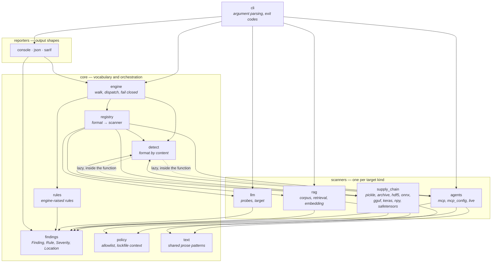

# Architecture

How the modules fit together, generated from the import graph rather than drawn from
memory. Every edge below is an actual `import` in `src/modelwarden`.

## The shape

Four layers, and the direction of dependency is the point: **scanners know about the
core, the core does not know about scanners** — with two deliberate exceptions marked
below.

The two dotted edges are cycles, and they are deliberate. Detection has to ask a
scanner what a format *looks like* — ONNX is recognised by protobuf shape, HDF5 by a
superblock search, MCP JSON by document shape — while every scanner needs `Format`
from detection. The import happens inside the function that needs it, so nothing is
circular at module load. A test asserts the package imports nothing outside the
standard library, which is what keeps this honest.

## Who depends on nothing

These modules import no other part of the package, which is why they are safe to
change last and safe to depend on first:

| Module | Lines | What it is |
|---|---:|---|
| `core.findings` | 80 | `Finding`, `Rule`, `Severity`, `Location` — the vocabulary every other module speaks |
| `core.policy` | 76 | The import allowlist and lockfile, held in context managers |
| `core.text` | 57 | Prose patterns shared by the MCP and corpus scanners, so the two cannot drift |
| `supply_chain._protobuf` | 122 | A read-only protobuf wire reader, so the scanner shares no parser with the loaders it inspects |
| `supply_chain._json` | 24 | Strict JSON with duplicate-key detection |
| `llm.target` | 142 | An OpenAI-compatible chat client over `urllib` |

## Weight

Size is a rough guide to where the difficulty lives, not to importance.

| Module | Lines | Why it is that size |
|---|---:|---|
| `supply_chain.hdf5` | 760 | A read-only HDF5 walker: superblocks v0–v3, object headers, symbol tables, B-trees v1 and v2, local and global heaps, fractal heaps and their doubling tables |
| `agents.mcp` | 433 | Tool definitions, per-field lockfile digests, and the rug-pull comparison |
| `rag.corpus` | 378 | Document rules plus chunk-aware density, measured over the windows a retriever actually stores |
| `llm.probes` | 338 | Five probes, their prompts, and the JSON loader for custom ones |
| `supply_chain.pickle` | 302 | An opcode walk with an emulated stack and memo — never an unpickler |
| `agents.live` | 299 | Two MCP transports: newline-delimited JSON-RPC over stdio, and JSON-RPC over HTTP with an SSE reply |

## The rules that hold this together

- **Every scanner has the same shape.** `scan(target) -> Iterable[Finding]`, whether
  the target is a file, a tool list, a corpus document or a live endpoint. The engine
  does not know what kind of thing it is dispatching to.
- **Severity comes from the catalogue, never from the caller.** A custom probe names
  an existing rule instead of inventing a severity, so it reports like a built-in one.
- **Failure is a finding.** An unparseable member, a scanner crash, an unreachable
  endpoint, a file whose classification hit a limit — each produces a finding rather
  than silence, because "not analysed" is not "clean".
- **The core has no dependencies.** One optional extra (`modelwarden[rag]`) adds a
  dense retriever, imported inside the single function that needs it and nowhere else.
  Two tests enforce both halves of that claim.
